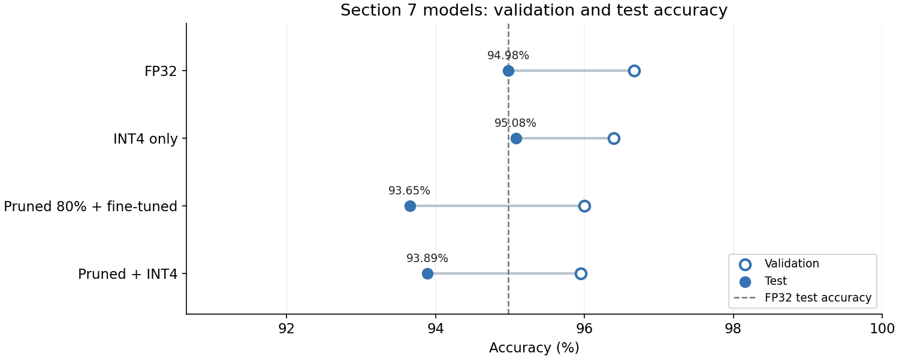
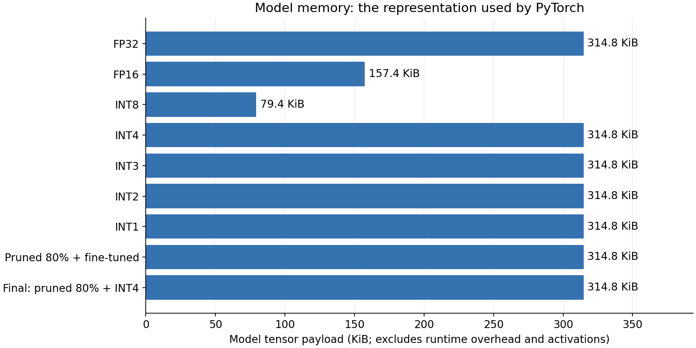

# Edge AI: Model Compression with Pruning and Quantization

A hands-on notebook for making a human activity classifier more compact and evaluating the trade-offs in **accuracy, storage, model memory, and inference latency**.

Using smartphone motion features, we train a neural network, apply pruning and quantization, combine the two methods, and export models for inference with ONNX Runtime.

**Start here:** [Open the notebook](Edge%20AI%20-%20Model%20Optimization.ipynb).

## Task and dataset

The task is to predict one of six activities from a smartphone sensor window:

**Walking · Walking upstairs · Walking downstairs · Sitting · Standing · Lying down**

We use [Human Activity Recognition Using Smartphones (UCI HAR)](https://archive.ics.uci.edu/dataset/240/human+activity+recognition+using+smartphones). The dataset contains recordings from 30 participants wearing a waist-mounted smartphone with an accelerometer and gyroscope.

Each model input contains **561 precomputed features** describing a 2.56-second window. The classifier uses these feature vectors; the included sensor signals are also used for exploration.

| Split | Windows | Participants | Purpose |
|---|---:|---:|---|
| Official training split | 7,352 | 21 | Further divided by participant into training and validation |
| Official test split | 2,947 | 9 | Final evaluation on different participants |

Validation uses five of the training participants. Model settings are selected using validation results, then held fixed for test evaluation. Activity labels are converted from `1–6` to `0–5` in the notebook.

## What the notebook covers

1. **Understand the data:** activity distribution, sensor signals, feature distributions, and PCA visualization.
2. **Train a baseline:** an FP32 multilayer perceptron with architecture **561 → 128 → 64 → 6** and **80,582 parameters**.
3. **Quantize:** compare FP16, dynamic INT8, and simulated INT4, INT3, INT2, and binary weights.
4. **Prune:** apply global magnitude pruning at different sparsity levels and fine-tune while keeping pruned weights at zero.
5. **Combine:** select pruning and quantization settings using a validation accuracy tolerance of one percentage point.
6. **Deploy:** reuse ONNX export and session helpers, verify predictions, and compare actual files and CPU latency.
7. **Evaluate:** compare frozen models on the official test set and visualize model tensor memory.

## Final results

The saved run selected **80% pruning followed by INT4 quantization**. The table below reports the notebook's recorded results; these are not averages across repeated runs.

| Model | Test accuracy | Test macro F1 | Accuracy change vs. FP32 |
|---|---:|---:|---:|
| FP32 baseline | 94.98% | 0.9493 | — |
| INT4 only | 95.08% | 0.9500 | +0.10 pp |
| 80% pruned + fine-tuned | 93.65% | 0.9365 | −1.32 pp |
| **80% pruned + INT4** | **93.89%** | **0.9389** | **−1.09 pp** |



*Hollow markers show validation accuracy; filled markers show test accuracy. The dashed line is the FP32 test reference.*

The combination passed the one-percentage-point tolerance on validation, but its test decrease was **1.09 percentage points**. The validation rule is not a guarantee about test performance. INT4-only's 0.10-point increase is just three additional correct test windows and does not establish a reliable accuracy improvement.

### Deployment result

The selected model is stored in `final_int4.onnx` using a UINT4 weight representation. The notebook checks that this graph and the direct FP32 export preserve the selected PyTorch model's test predictions.

| Deployment | Actual file size | Test accuracy | Recorded latency per window |
|---|---:|---:|---:|
| Original FP32, PyTorch state dictionary | 317.8 KiB | 94.98% | 0.0955 ms |
| Selected model, FP32 ONNX export | 321.5 KiB | 93.89% | 0.0535 ms |
| Selected model, UINT4 ONNX with folding requested | **41.9 KiB** | **93.89%** | **0.0459 ms** |

The UINT4 ONNX file is approximately **7.6× smaller** than the baseline state dictionary. Timings use one CPU thread, batch size 1, warm-up, and the median of repeated timing blocks. They exclude model loading and feature extraction. Cross-runtime speed differences cannot be attributed to compression alone; timings will vary by machine.

## Memory: what is actually smaller?



The plot measures the **numerical payload of model tensors**, including quantized weights and metadata exposed by PyTorch. It excludes activations, allocator overhead, backend packing overhead, and loaded libraries. It is **not peak process RAM**.

- **FP32:** approximately 314.8 KiB of model tensors.
- **FP16:** approximately 157.4 KiB.
- **Dynamic INT8:** approximately 79.4 KiB.
- **Simulated INT1–INT4 and dense pruned models:** approximately 314.8 KiB, because they execute with reconstructed FP32 tensors.

A smaller stored file does not automatically mean lower inference RAM. ONNX may decode low-bit weights when loading or executing the graph. The notebook reports ONNX runtime memory as unmeasured, rather than treating file size as RAM usage.

## Run the notebook

```bash
git clone https://github.com/TurgudValiyev2002/EDGE-AI---model_compression.git
cd EDGE-AI---model_compression
python -m venv .venv
```

Activate the environment:

```powershell
# Windows PowerShell
.\.venv\Scripts\Activate.ps1
```

```bash
# macOS / Linux
source .venv/bin/activate
```

Install Jupyter and launch the notebook:

```bash
python -m pip install jupyterlab ipykernel
python -m jupyter lab "Edge AI - Model Optimization.ipynb"
```

Run the notebook from the repository root so that `UCI HAR Dataset/` is available at the expected relative path. Execute cells from top to bottom. The setup cell checks and installs missing or outdated dependencies, including PyTorch, NumPy, Matplotlib, scikit-learn, ONNX, ONNX Runtime, and ONNXScript. If it installs packages, restart the kernel and run from the beginning as instructed.

The notebook was validated with Python 3.13, PyTorch 2.11.0+cpu, ONNX 1.22.0, and ONNX Runtime 1.23.2. The setup uses minimum versions rather than a fully pinned environment. Fine-tuning randomness and runtime differences can change results.

To read the recorded experiment without training, view the notebook's saved outputs and the figures above.

## Repository layout

```text
Edge AI - Model Optimization.ipynb    # Complete notebook with saved outputs
UCI HAR Dataset/                      # Features, labels, participant IDs, sensor signals
assets/
  final-accuracy.png                  # Final validation/test comparison
  model-memory.png                    # Model tensor memory comparison
  results.json                        # Recorded final evaluation metrics
```

Running the notebook creates `baseline_artifacts/`, `quantization_artifacts/`, `pruning_artifacts/`, `onnx_artifacts/`, and `final_test_artifacts/`. Deployment models are generated by the notebook; they are not included in this repository. The dataset occupies approximately 283 MB before compression.

## Dataset attribution

Davide Anguita, Alessandro Ghio, Luca Oneto, Xavier Parra, and Jorge L. Reyes-Ortiz. **A Public Domain Dataset for Human Activity Recognition Using Smartphones.** ESANN, 2013.

See the [UCI dataset page](https://archive.ics.uci.edu/dataset/240/human+activity+recognition+using+smartphones) and the included [dataset README](UCI%20HAR%20Dataset/README.txt) for the original documentation and usage terms. Dataset authors retain credit for the data.
